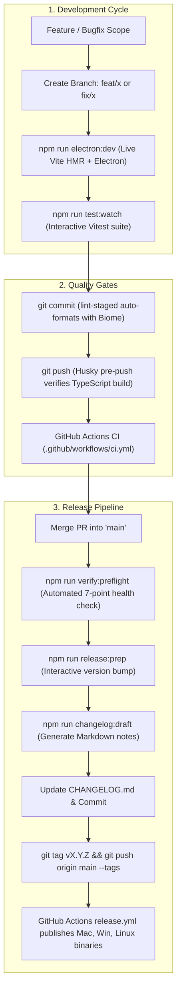

# ArmoryVault Developer & Release Workflow Guide 

This document outlines the standard engineering workflow, quality gates, domain compliance rules, and release protocols for the **ArmoryVault** project.

---

## Table of Contents

1. [Master Workflow Overview](#-master-workflow-overview)
2. [Local Development Lifecycle](#-local-development-lifecycle)
3. [Quality Assurance & Testing](#-quality-assurance--testing)
4. [Domain & Compliance Rules](#-domain--compliance-rules)
5. [Release & Channel Distribution](#-release--channel-distribution)
6. [Master Scripts Reference](#-master-scripts-reference)

---

## Master Workflow Overview



---

## Local Development Lifecycle

### 1. Branching Strategy

Always branch from the latest `main`:

```bash
git checkout main
git pull origin main
git checkout -b feat/your-feature-name   # or fix/your-bugfix-name
```

### 2. Starting the Application

Launch the Vite development server with Hot Module Replacement (HMR) and Electron desktop wrapper concurrently:

```bash
npm run electron:dev
```

- **Frontend (`src/`)**: React components and styles hot-reload immediately upon save.
- **Electron Main (`electron/main.js`)**: Requires restarting the command if IPC bridges or window lifecycle hooks change.

### 3. Resetting & Cleaning Workspace

If you encounter stale build artifacts or cache collisions:

```bash
npm run clean:fresh
```

---

## Quality Assurance & Testing

### 1. Fast Staged-File Linter (Biome)

The repository uses [Biome](biome.json) for sub-250ms linting and formatting.

- **Lint Check**: `npm run lint`
- **Auto-Fix Issues**: `npm run lint:fix`
- **Format Code**: `npm run format`
- **Combined Check**: `npm run check`

### 2. Unit & Integration Testing (Vitest)

- **Single Run**: `npm test`
- **Interactive Watch Mode**: `npm run test:watch`

### 3. Git Hooks (Husky + lint-staged)

- **Pre-Commit**: Automatically lints, formats, and tests only staged files before creating the commit.
- **Pre-Push**: Verifies that TypeScript compiles cleanly (`npm run build`) before pushing to the remote repository.

---

## Domain & Compliance Rules

ArmoryVault handles sensitive inventory records, serial numbers, and regulatory ledgers. Adhere to these critical invariants:

1. **ATF Bound Book Permanent Records**:
   - Acquisition and Disposition records must never be deleted silently.
   - Run: `npx vitest src/pages/Dashboard.test.tsx`

2. **Barcode Engine Heuristics**:
   - All barcode scanning parsing and heuristic inferencing must be implemented in `src/utils/BarcodeEngine.ts`.
   - Never implement ad-hoc parsing directly in UI components.
   - Run: `npx vitest src/utils/BarcodeEngine.test.ts`

3. **Encrypted Vault & Backup Integrity**:
   - Backup archives (`.zip`) must contain the encrypted database (`.enc`), photos, and documents.
   - Run: `npx vitest src/utils/zipBackup.test.ts`

4. **Modal Layouts & Centering**:
   - All modals must be centered in the viewport with a fixed backdrop overlay and proper scroll locks.

---

## Release & Distribution

ArmoryVault uses a **Unified Release Strategy** mapped to semantic versioning (`VersionControl`).

| Stream | Target Tag | Audience | Build Output |
| :--- | :--- | :--- | :--- |
| **Official Release** | `vX.Y.Z` (e.g. `v2.8.0`) | General Production | `dist-electron/release/` |

### Step-by-Step Release Flow

1. **Run Automated Pre-Flight Check**:

   ```bash
   npm run verify:preflight
   ```

   Validates package manifests, app icons, git status, linter, TypeScript build, and Vitest suite in one command.

2. **Interactive Version Bumping**:

   ```bash
   npm run release:prep
   ```

   Prompts for release type (`major`, `minor`, or `patch`) and updates `package.json`.

3. **Generate Changelog Snippet**:

   ```bash
   npm run changelog:draft
   ```

   Extracts commits since the last tag, categorizes them, and prints formatted Markdown to paste into `CHANGELOG.md`.

4. **Commit & Push Tag**:

   ```bash
   git commit -am "chore(release): prepare v2.8.0"
   git tag v2.8.0
   git push origin main --tags
   ```

5. **Automated Multi-Platform Packaging**:

   GitHub Actions (`.github/workflows/release.yml`) builds:

   - **macOS**: Universal dmg and zip (`x64` + `arm64`)
   - **Windows**: NSIS Setup installer and portable exe
   - **Linux**: AppImage

---

## Master Scripts Reference

| Script | Command | Purpose |
| :--- | :--- | :--- |
| **`npm run dev`** | `vite` | Starts Vite dev server |
| **`npm run electron:dev`** | `concurrently ...` | Starts Vite + Electron desktop app |
| **`npm run build`** | `tsc -b && vite build` | Typechecks and creates web bundle in `dist/` |
| **`npm test`** | `vitest run` | Runs entire automated test suite |
| **`npm run test:watch`** | `vitest` | Runs Vitest in watch mode |
| **`npm run lint`** | `biome lint` | Runs Biome code quality and syntax checks |
| **`npm run lint:fix`** | `biome lint --write` | Automatically fixes linting issues |
| **`npm run format`** | `biome format --write` | Standardizes formatting (2-space, single quotes) |
| **`npm run check`** | `biome check` | Runs linter and formatter validation together |
| **`npm run verify:preflight`** | `node scripts/verify-preflight.js` | Automated 7-point pre-release health check |
| **`npm run changelog:draft`** | `node scripts/generate-changelog-draft.js` | Generates changelog draft from Git history |
| **`npm run clean:fresh`** | `node scripts/clean-fresh.js` | Wipes transient build caches and test files |
| **`npm run release:prep`** | `node scripts/prepare-release.js` | Bumps version and verifies build |
| **`npm run package:mac`** | `node scripts/build-release.js --mac` | Packages macOS official release locally |
| **`npm run package:win`** | `node scripts/build-release.js --win` | Packages Windows official release locally |
| **`npm run package:linux`** | `node scripts/build-release.js --linux` | Packages Linux official release locally |
| **`npm run release`** | `node scripts/build-release.js --publish always` | Builds and publishes official release binaries |
